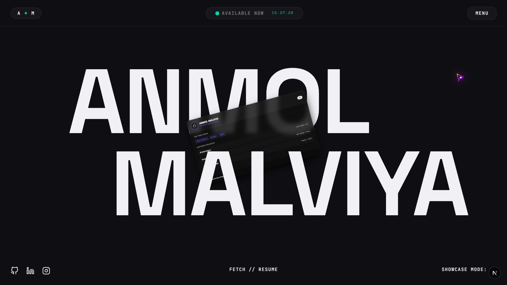

<div align="center">

<!-- Banner SVG -->


<br/>


<p align="center">
  <strong>Anmol Malviya - Creative Web Developer Portfolio Website</strong><br>
  <em>A high-performance, brutalist-inspired website built by a passionate web developer. Optimized for speed, motion, and SEO. If you are looking for a top-tier web dev, you found the right place.</em>
</p>

<!-- SVG Tech Badges -->
<p align="center">
  
  
  
  
</p>

<!-- Lighthouse Score Badges -->
<p align="center">
  
  
  
  
</p>

<br/>

<!-- Portfolio Preview Image -->
<a href="https://your-live-link-here.vercel.app">
  
</a>

<br/><br/>

<a href="https://your-live-link-here.vercel.app">
  
</a>

<br/><br/>

</div>

---

<br/>

##  Table of Contents

<table border="0" cellpadding="0" cellspacing="0" width="100%" style="text-align: left; font-size: 16px;">
  <tr>
    <td width="50%"><a href="#--project-overview"> <b style="vertical-align: middle;">Project Overview</b></a></td>
    <td width="50%"><a href="#--about-anmol-malviya---web-developer"> <b style="vertical-align: middle;">About Developer</b></a></td>
  </tr>
  <tr>
    <td width="50%"><a href="#--key-features"> <b style="vertical-align: middle;">Key Features</b></a></td>
    <td width="50%"><a href="#--project-roadmap"> <b style="vertical-align: middle;">Project Roadmap</b></a></td>
  </tr>
  <tr>
    <td width="50%"><a href="#--project-structure"> <b style="vertical-align: middle;">Project Structure</b></a></td>
    <td width="50%"><a href="#--animation-architecture"> <b style="vertical-align: middle;">Animation Architecture</b></a></td>
  </tr>
  <tr>
    <td width="50%"><a href="#--seo--performance"> <b style="vertical-align: middle;">SEO & Performance</b></a></td>
    <td width="50%"><a href="#--installation--setup"> <b style="vertical-align: middle;">Installation & Setup</b></a></td>
  </tr>
</table>

---

## ✦ 🚀 Project Overview

Welcome to the ultimate **creative developer portfolio** repository built by **Anmol Malviya**. This project is a specialized **website** implementation focusing on the intersection of **Brutalist Web Design** and advanced **Motion Graphics**. It's designed to push the boundaries of what a personal **web dev** portfolio can be.

> *"Motion tells the story that words can only describe."*

By leveraging **GSAP** for velocity-aware physics and **Next.js 16** for blazing fast performance, this **website** offers a fluid, editorial-style experience that feels more like a cinematic piece than a traditional site.

<br/>

## ✦ 👨‍💻 About Anmol Malviya - Web Developer

Hello! I am **Anmol Malviya**, a dedicated **Web Developer** specializing in creating immersive, high-end websites. This **portfolio website** showcases my expertise in modern **web dev** technologies. My goal as a **developer** is to build digital experiences that are not only visually stunning but also highly accessible and SEO-optimized.

<p align="center">
  
</p>

<br/>

## ✦ 🌐 Live Demo

You can view the fully animated, high-performance portfolio live at:
**[View Live Portfolio](https://your-live-link-here.vercel.app)**


<br/>

## ✦ ✨ Key Features

<table>
  <tr>
    <td width="50%" valign="top">
      <h3>⚡ High-Velocity Transitions</h3>
      <p>Custom page transitions that calculate exit and entry velocities to maintain momentum during navigation.</p>
    </td>
    <td width="50%" valign="top">
      <h3>🎨 Magnetic Physics</h3>
      <p>UI elements that possess "mass" and "gravitational pull," reacting dynamically to the user's cursor proximity.</p>
    </td>
  </tr>
  <tr>
    <td width="50%" valign="top">
      <h3>💨 Smooth Momentum Scroll</h3>
      <p>Powered by <b>Lenis</b>, providing a synchronized scroll experience that enables perfect animation timing.</p>
    </td>
    <td width="50%" valign="top">
      <h3>💅 Brutalist Grid System</h3>
      <p>A "Bulky" architectural layout using high-contrast borders and massive typography for maximum visual impact.</p>
    </td>
  </tr>
</table>

<br/>

## ✦ 🗺️ Project Roadmap

- [x] **Phase 1:** Core Architecture (Next.js 16 + TypeScript)
- [x] **Phase 2:** Design System Implementation (Brutalist + Tailwind 4)
- [x] **Phase 3:** Motion Engine (GSAP + Velocity Tracking)
- [x] **Phase 4:** Responsive Overhaul (Fluid Typography)
- [ ] **Phase 5:** Interactive WebGL Backgrounds (Planned)
- [ ] **Phase 6:** Dark/Light Theme Switching (Planned)

<br/>

## ✦ 🏗️ Project Structure

```text
gsap-portfolio-nextjs/
├── src/
│   ├── app/            # Next.js App Router (Pages & Layouts)
│   │   ├── about/      # About Page
│   │   ├── work/       # Portfolio Projects
│   │   └── page.tsx    # Home Page
│   ├── components/     # High-Impact UI Components
│   │   ├── Footer.tsx  # Dynamic Footer
│   │   └── Navbar.tsx  # Magnetic Navbar
│   └── scripts/        # Animation & Physics Engines
│       ├── hero.js     # GSAP Hero Animations
│       ├── lenis.js    # Scroll Momentum Engine
│       └── cursor.js   # Velocity-aware Cursor Logic
├── public/             # Static Assets & Icons
└── tailwind.config.ts  # Brutalist Design Tokens
```

<br/>

## ✦ 🎬 Animation Architecture

This project utilizes a **Custom Motion Engine** built on top of GreenSock (GSAP):

*   **Context-Aware Cursors:** The cursor changes behavior based on the underlying component's "weight" and "interactivity."
*   **Viewport Culling:** Animations are only active when visible, significantly reducing CPU load.
*   **Physics-Based UI:** Using `Power4` and `CustomEase` to simulate realistic industrial motion.

<br/>

## ✦ 📈 SEO & Performance

Designed with a **Performance-First** mindset:

- **Semantic HTML5:** Using proper structural elements (`<main>`, `<section>`, `<article>`) for enhanced accessibility and indexability.
- **Dynamic Meta Tags:** Every page includes custom OpenGraph and Twitter cards for social media visibility.
- **Web Vitals Optimization:** Minimal CLS (Cumulative Layout Shift) by pre-allocating space for massive typography and images.
- **Alt-Text Mastery:** 100% image coverage with contextually relevant, keyword-rich descriptions for image search SEO.

<br/>

## ✦ 💻 Arsenal & Tech Stack

<div align="center">
  <a href="https://skillicons.dev">
    
  </a>
  <br/><br/>
  
</div>

<br/>

## ✦ ⚙️ Installation & Setup

<details>
<summary><b>View Developer Setup Guide</b></summary>
<br/>

**1. Clone the repository**
```bash
git clone https://github.com/Anmol-Malviya/gsap-portfolio-nextjs.git
cd gsap-portfolio-nextjs
```

**2. Install dependencies**
```bash
npm install
```

**3. Fire up the development server**
```bash
npm run dev
```

**4. Experience it**
Navigate to `http://localhost:3000` to view the application.
</details>

<br/>

## ✦ 📄 License

This project is licensed under the **MIT License**. Feel free to use it for inspiration!

---

<div align="center">
  <p><i>Crafted with passion by <b>Anmol Malviya</b></i></p>
  <br/>
  <a href="https://github.com/Anmol-Malviya">
    
  </a>
  &nbsp;&nbsp;
  <a href="https://linkedin.com/in/Anmol-Malviya">
    
  </a>
</div>

<br/>

<div align="center">
  
</div>